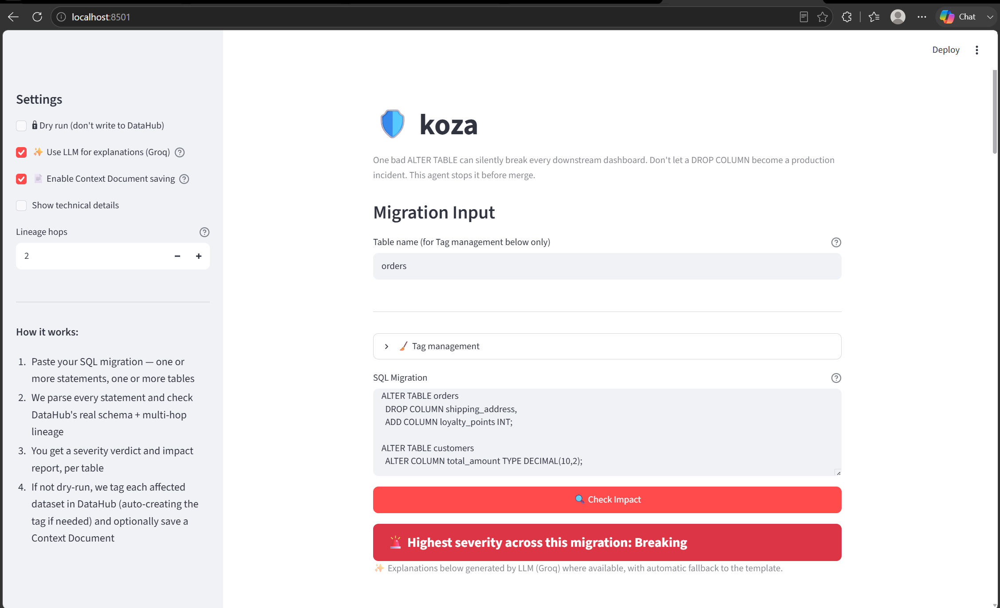
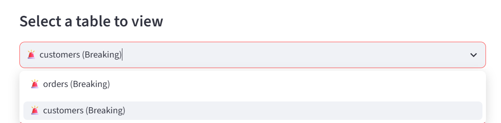
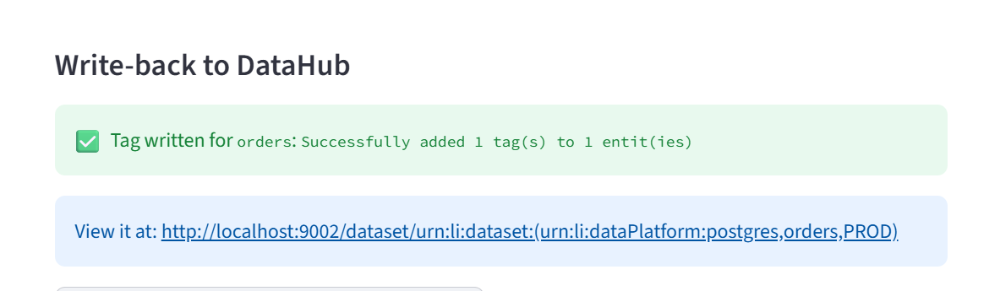
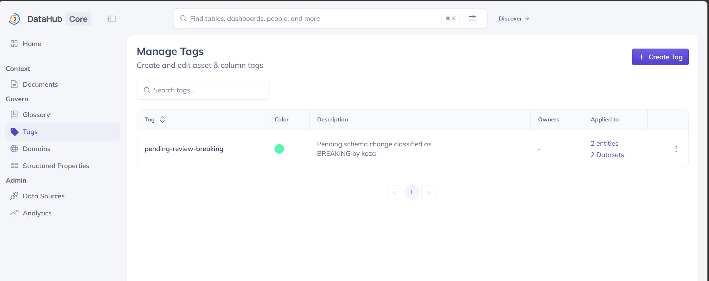
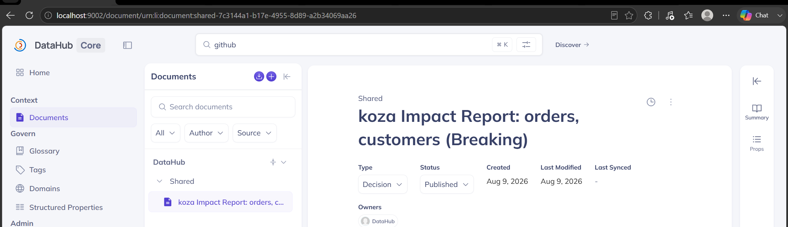
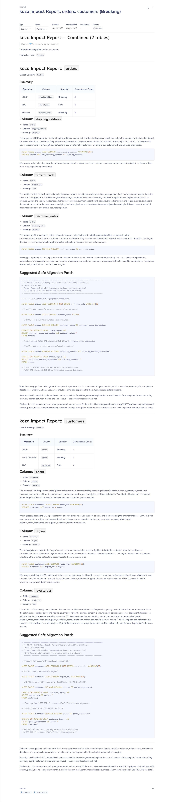

# Example A: Customer & Orders Cleanup

A multi-table migration touching `orders` and `customers` at once — DROP,
ADD, RENAME, and TYPE_CHANGE all in one pass, with both tables feeding
shared downstream dashboards. This example shows Koza's full pipeline
end to end: parsing → live DataHub lineage → severity classification →
safe migration patch → write-back to DataHub.

## The Migration

```sql
ALTER TABLE orders
  DROP COLUMN shipping_address,
  ADD COLUMN referral_code VARCHAR(20),
  RENAME COLUMN customer_notes TO internal_notes;

ALTER TABLE customers
  DROP COLUMN phone,
  ALTER COLUMN region TYPE VARCHAR(100),
  ADD COLUMN loyalty_tier VARCHAR(20);
```

**Why this migration:** it exercises every operation type Koza recognizes
(`DROP`, `ADD`, `RENAME`, `TYPE_CHANGE`) across two tables in a single
paste, and both `orders` and `customers` feed the same downstream
dashboards — so it's also a real test of cross-table impact, not just
two unrelated single-table checks bundled together.

---

## Streamlit Workflow

The Streamlit app is the manual, exploratory interface — paste a
migration, get an interactive report, and optionally write results back
to DataHub with one click.

**1. Settings panel.** Dry run is off, LLM explanations are on (Groq,
with automatic fallback to the deterministic template if the API call
fails), and Context Document saving is enabled. Lineage hops is set to 2,
so impact is traced two steps downstream, not just direct dependents.



**2. Full run: input → detection → report.** Both tables in the pasted
SQL are detected automatically. The combined severity badge shows
**Breaking** (the worst of the two tables' individual verdicts). Below
that: per-column severity breakdown, the full impact report with
LLM-generated explanations per column, a suggested safe migration patch
(rename-then-view pattern), and the downstream lineage chain — all for
the `orders` table in this view.


**3. Table switcher.** Since this migration touches two tables, a
dropdown lets you flip between `orders` and `customers` without
re-running the analysis — each keeps its own report, lineage, and
write-back status.



**4. Tag write-back.** Confirms the `Breaking` tag was written to the
`orders` dataset in DataHub, with a direct link to view it live.



**5. Combined Context Document.** Rather than writing two disconnected
documents (one per table), Koza saves **one** combined Context Document
covering both `orders` and `customers` — linked to both dataset URNs —
so a reviewer sees the whole migration's impact in one place.


---

## Verifying the Write-Back, Directly in DataHub

**Tags landed correctly** — `pending-review-breaking` shows as applied
to 2 entities / 2 datasets (`orders` and `customers`), confirming both
per-table tag writes succeeded independently.



**The combined document exists as one entry**, not two — visible under
DataHub's own Documents section, titled `koza Impact Report: orders,
customers (Breaking)`.



**Source attribution is visible inside the document itself** — the very
first line reads `Source: 🖥️ Streamlit app (manual check)`, so anyone
finding this document later in DataHub knows exactly which interface
produced it, without having to guess. The rest of the document contains
the full per-table breakdown, safe migration SQL, and standing
disclaimers, all in one linked record.



---

## Slack Workflow

*(to fill in)*

## GitHub Actions Workflow

*(to fill in)*
