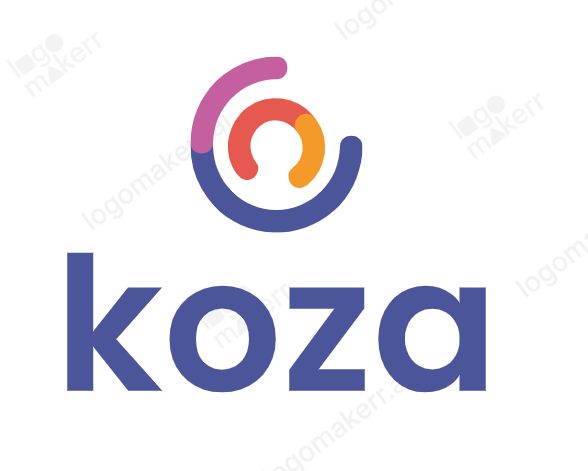
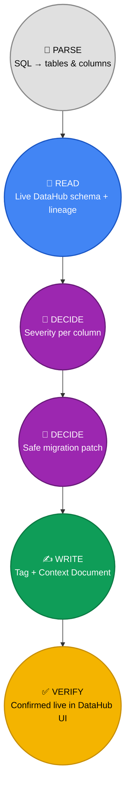

<p align="center">
  
</p>

<h3 align="center">One bad <code>ALTER TABLE</code> can silently break every downstream dashboard.</h3>
<p align="center"><i>Koza stops it before merge.</i></p>

<p align="center">
  
  
  
</p>

---

Koza reads a SQL migration, checks DataHub's real lineage graph to see
what actually depends on the columns being changed, classifies the
risk, and generates a safe rewrite — before the change ever reaches
production. It runs the same way in three places: a Streamlit app you
drive manually, a Slack bot you can ask directly, and a GitHub Action
that comments on every PR automatically.

In practice, that means you're never manually tracing a lineage graph
by hand to figure out whether something depends on the table you're
about to change — Koza already checked. And it saves time by meeting
you wherever you actually are: open a PR on GitHub, work through the
browser via Streamlit, or just mention `@koza analyze <SQL>` or
`@koza multi <SQL>` in the middle of a Slack conversation about a
schema change. All three paths run the same underlying analysis
against the same DataHub instance — DataHub isn't a bolt-on for one
interface, it's load-bearing across all three.

## Demo Video

📺 **[Watch the 3-minute walkthrough](#)** — Koza catching a breaking
change in Streamlit, answering a follow-up question in Slack, and
blocking a PR automatically in GitHub Actions, all against the same
live DataHub instance.

*(Link goes live once the recording is uploaded — see `examples/` for
static screenshots of each interface in the meantime.)*

> **If you only do one thing:** open [`examples/`](examples/). Every
> claim in this README is demonstrated there with real, uncropped
> screenshots — Streamlit's live report, Slack's conversation, and the
> actual PR comment GitHub Actions posted. Nothing in this repo is a
> mockup.

## Table of Contents

- [Demo Video](#demo-video)
- [The Problem](#the-problem)
- [How Koza Solves It](#how-koza-solves-it)
- [Three Interfaces, One Core](#three-interfaces-one-core)
- [See It In Action](#see-it-in-action)
- [Setup](#setup)
- [Quick Start Per Interface](#quick-start-per-interface)
- [Known Limitations](#known-limitations)
- [Project Structure](#project-structure)
- [License](#license)

## The Problem

Schema changes are one of the most common causes of silent production
incidents. A developer drops a column that looks unused locally — three
dashboards break the next morning, and nobody finds out until someone
complains. The column *looked* safe. Nothing in a normal code review
tells you it wasn't.

The information to prevent this already exists — it's sitting in your
data catalog's lineage graph. It's just never consulted at the moment
it would actually help: when the PR is open, before the merge.

## How Koza Solves It

Every migration Koza analyzes follows the same loop, regardless of
which interface triggered it:



- **Parse** — a SQL migration (one or more `ALTER TABLE` / `DROP TABLE`
  statements, one or more tables) is broken down into individual
  column-level operations.
- **Read** — for every table touched, Koza queries DataHub's real
  lineage graph for downstream dependents, traversing multiple hops
  (not just direct consumers) so a change two tables removed from a
  dashboard still gets caught.
- **Decide** — each operation is classified as `Safe`, `Low`,
  `Breaking`, or `Critical` based on the operation type, whether the
  column is PII-tagged, and how many real downstream consumers exist —
  deterministically, so the same input always produces the same
  verdict.
- **Write** — for `Breaking`/`Critical` changes, Koza generates a safe
  rename-then-view migration patch, tags the affected dataset in
  DataHub, and saves a Context Document recording the full analysis —
  attributed to whichever interface produced it.
- **Verify** — every write-back is independently checkable in DataHub's
  own UI. Nothing here is a mock; every screenshot in the `examples/`
  folder is a real run against a real DataHub instance.

## Three Interfaces, One Core

| Interface | How it's used | Write-back to DataHub |
|---|---|---|
| **Streamlit** | Paste SQL, click a button, get an interactive report | ✅ Tags + combined Context Document |
| **GitHub Actions** | Opens automatically on any PR touching `.sql` files | ✅ Tags + combined Context Document |
| **Slack** | `@koza analyze <SQL>` or `@koza multi <SQL>` in any channel | ❌ Read-only — analyzes and displays, does not write back (see [Known Limitations](#known-limitations)) |

All three call into the same underlying parsing, severity, and lineage
logic — there is one source of truth for what counts as `Breaking`,
not three separately-maintained copies.

## See It In Action

Three worked examples, each showing a different interface end-to-end
against a real DataHub instance, with every screenshot un-cropped and
every write-back independently verified in DataHub's own UI:

- **[Example A — Customer & Orders Cleanup](examples/01-customer-orders-cleanup.md)**
  Two tables, every operation type (`DROP`/`ADD`/`RENAME`/`TYPE_CHANGE`),
  demonstrated through **Streamlit** with full write-back.
- **[Example B — Product & Supplier Overhaul](examples/02-product-supplier-overhaul.md)**
  Two tables, heavy on the riskiest operations (type changes, renames),
  demonstrated through **Slack**'s multi-table analysis.
- **[Example C — Support & Marketing Refresh](examples/03-support-marketing-refresh.md)**
  Three tables in one PR, demonstrated through **GitHub Actions** running
  fully automated — no human interaction beyond opening the PR.

## Setup

### Prerequisites

- Python 3.12+
- A running DataHub instance (`datahub docker quickstart`, or a hosted
  instance you have a Personal Access Token for)
- For the Slack bot: a Slack workspace where you can install a custom app
- For GitHub Actions: [ngrok](https://ngrok.com) (or similar), to expose
  your local DataHub instance to GitHub's cloud runners — see
  [Exposing DataHub to GitHub Actions](#setup) below

### Install

```
git clone https://github.com/kz6767824-netizen/koza.git
cd koza
python -m venv venv
venv\Scripts\activate          # Windows
pip install -r requirements.txt
```

### Get a DataHub token

Log into your DataHub UI → Settings → Access Tokens → generate one.
DataHub only shows the value once, so save it immediately.

```
set DATAHUB_TOKEN=eyJ...
```

### Exposing DataHub to GitHub Actions (ngrok)

GitHub's runners execute in the cloud — they cannot reach `localhost`
on your machine, so a locally-running DataHub instance needs a public
tunnel for the CI workflows to query it. This project uses
[ngrok](https://ngrok.com):

```
ngrok http 8081
```

Copy the `https://...ngrok-free.app` URL ngrok prints and set it as
the `DATAHUB_GMS_URL` repository secret (Settings → Secrets and
variables → Actions), alongside `DATAHUB_GMS_TOKEN` set to the same
token from the step above. Keep the `ngrok http 8081` terminal window
open — closing it drops the tunnel, and any PR check that runs after
that will fall back to `offline` mode automatically rather than fail.

This isn't just a setup requirement, it's a real reliability property:
during development, the tunnel dropped mid-testing more than once, and
every time, the CI check degraded to offline mode and still posted a
useful structural-risk report instead of the workflow just failing red.
Koza was built and tested against real network interruption, not just
the happy path.

## Quick Start Per Interface

### Streamlit

```
streamlit run app.py
```
Paste a migration, toggle "Dry run" off if you want real write-backs,
optionally set `GROQ_API_KEY` to enable LLM-generated explanations
(falls back to the deterministic template automatically if unset or if
the call fails).

### Slack

1. Create a Slack app at [api.slack.com/apps](https://api.slack.com/apps)
   → **Blank app**, enable **Socket Mode** (generates an `xapp-` token —
   no public URL needed), add Bot Token Scopes `app_mentions:read`,
   `chat:write`, `commands`, subscribe to the `app_mention` bot event,
   install to your workspace (generates an `xoxb-` token).
2. Set the tokens and run:
```
set SLACK_BOT_TOKEN=xoxb-...
set SLACK_APP_TOKEN=xapp-...
python agent\slack_bot.py
```
3. Invite the bot to a channel and message it:
```
@koza analyze ALTER TABLE orders DROP COLUMN shipping_address;
@koza multi ALTER TABLE orders DROP COLUMN x; ALTER TABLE customers DROP COLUMN y;
```
Use `analyze` for a single-table migration. Use `multi` when your
message contains statements for more than one table — it loads every
table it finds into that channel's session, so follow-up questions
(`report`, `severity`, `downstream`, `patch`) can target any of them by
name, not just the one you started with.

### GitHub Actions

Add `DATAHUB_GMS_URL` and `DATAHUB_GMS_TOKEN` as repository secrets
(Settings → Secrets and variables → Actions). Both workflows
(`.github/workflows/`) trigger automatically on any PR touching `.sql`
files or the `migrations/` folder — no manual setup beyond the secrets.
If the secrets are missing or DataHub is unreachable, checks
automatically fall back to `offline` mode (severity via structural risk
only, no live lineage) rather than failing the build.

## Known Limitations

Being upfront about what this doesn't do yet:

- **Slack is read-only.** It analyzes and displays but never writes
  tags or Context Documents back to DataHub — only Streamlit and
  GitHub Actions do that.
- **PII detection has a write path but no read path.** Koza can tag a
  column as PII in DataHub, but no read path is currently available
  through the Agent Context Kit tools to surface column-level tags
  back into the severity decision.
- **Multi-hop lineage is achieved by repeated 1-hop calls, not a
  native traversal.** The underlying DataHub lineage helper hardcodes
  a 1-hop limit internally; Koza works around this by calling it
  repeatedly (hop-1 results become hop-2's starting points), which
  works but costs one DataHub query per hop per table.
- **Multi-table migrations only recognize `ALTER TABLE` and
  `DROP TABLE` statements**, split on semicolons. Quoted or
  schema-qualified identifiers, `CHECK` constraints, and index/foreign-key
  changes aren't parsed.
- **Forked-repo PRs won't get live analysis in CI** — GitHub restricts
  secret access for `pull_request` events from forks by default, so
  those runs fall back to offline mode automatically.
- **Severity classification is deterministic**; if LLM-generated
  explanations are enabled, their wording can vary slightly between
  runs on identical input, but the severity label itself never does.

## Project Structure

```
koza/
  agent/                          Core logic: parsing, severity, lineage, patch
                                   generation, write-back, Slack bot, CI script
  .github/workflows/
    koza_impact_check.yml         Runs on every PR touching .sql files
    koza_patch_generator.yml      Generates + posts safe migration patches
  examples/                       Three worked examples, one per interface
  migrations/                     Sample .sql files for local testing
  patches/                        Generated safe-migration SQL (git-ignored)
  koza-reports/                   CI-generated markdown reports (git-ignored)
  tests/                          Test scripts
  app.py                          Streamlit entry point
  requirements.txt
```

## License

Apache-2.0 — see [LICENSE](LICENSE).

---

<p align="center"><i>Built for the DataHub Agent Hackathon 2026.</i></p>
