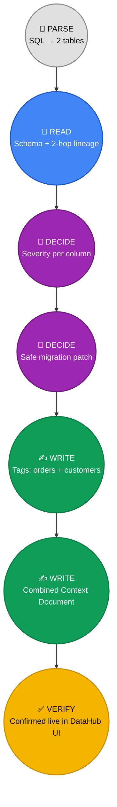
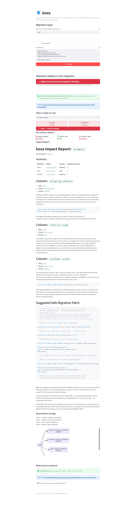
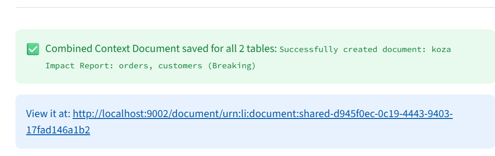

# Example A: Customer & Orders Cleanup

A multi-table migration touching `orders` and `customers` at once — DROP,
ADD, RENAME, and TYPE_CHANGE all in one pass, with both tables feeding
shared downstream dashboards. This example shows Koza's full pipeline
end to end: parsing → live DataHub lineage → severity classification →
safe migration patch → write-back to DataHub.

## The Migration

```sql
ALTER TABLE orders
  DROP COLUMN shipping_address,
  ADD COLUMN referral_code VARCHAR(20),
  RENAME COLUMN customer_notes TO internal_notes;

ALTER TABLE customers
  DROP COLUMN phone,
  ALTER COLUMN region TYPE VARCHAR(100),
  ADD COLUMN loyalty_tier VARCHAR(20);
```

**Why this migration:** it exercises every operation type Koza recognizes
(`DROP`, `ADD`, `RENAME`, `TYPE_CHANGE`) across two tables in a single
paste, and both `orders` and `customers` feed the same downstream
dashboards — so it's also a real test of cross-table impact, not just
two unrelated single-table checks bundled together.

## DataHub Touchpoints in This Example

The whole run collapses to one loop — parse, read from DataHub, decide
locally, write back to DataHub, verify. Every step below traces to a
real interaction, colored by type:



Every step below is tagged 🔎 **READ**, 🧠 **DECIDE**, or ✍️ **WRITE** so
it's clear exactly where DataHub is doing real work, versus where Koza is
just reasoning locally over data it already fetched.

| # | Action | DataHub Interaction |
|---|---|---|
| 1 | Parse SQL, extract `orders` + `customers` | *(local — no DataHub yet)* |
| 2 | 🔎 **READ** | Live schema + lineage lookup for both tables, 2 hops downstream |
| 3 | 🧠 **DECIDE** | Severity classified per-column using real downstream counts from step 2 |
| 4 | 🧠 **DECIDE** | Safe migration SQL patch generated from the classification |
| 5 | ✍️ **WRITE** | `Breaking` tag applied to `orders` dataset in DataHub |
| 6 | ✍️ **WRITE** | `Breaking` tag applied to `customers` dataset in DataHub |
| 7 | ✍️ **WRITE** | One combined Context Document saved, linked to both dataset URNs |

Nothing here is fabricated or cached — every severity number, downstream
count, and lineage chain in the screenshots below came from a live query
against a running DataHub instance at the moment the screenshot was
taken, and every write-back is independently verifiable in DataHub's own
UI (see the "Verifying the Write-Back" section below).

---

## Streamlit Workflow

The Streamlit app is the manual, exploratory interface — paste a
migration, get an interactive report, and optionally write results back
to DataHub with one click.

**1. Settings panel.** Dry run is off, LLM explanations are on (Groq,
with automatic fallback to the deterministic template if the API call
fails), and Context Document saving is enabled. Lineage hops is set to 2,
so impact is traced two steps downstream, not just direct dependents.


**2. 🔎 READ + 🧠 DECIDE — Full run: input → detection → report.** Both
tables in the pasted SQL are detected automatically. This is where the
live DataHub calls happen: schema + 2-hop downstream lineage are fetched
for both `orders` and `customers`, and severity is classified per column
using those real counts — not placeholders. The combined severity badge
shows **Breaking** (the worst of the two tables' individual verdicts).
Below that: per-column severity breakdown, the full impact report with
LLM-generated explanations per column, a suggested safe migration patch
(rename-then-view pattern), and the downstream lineage chain — all for
the `orders` table in this view.



**3. Table switcher.** Since this migration touches two tables, a
dropdown lets you flip between `orders` and `customers` without
re-running the analysis — each keeps its own report, lineage, and
write-back status.


**4. ✍️ WRITE — Tag write-back.** Confirms the `Breaking` tag was written
to the `orders` dataset in DataHub, with a direct link to view it live.


**5. ✍️ WRITE — Combined Context Document.** Rather than writing two
disconnected documents (one per table), Koza saves **one** combined
Context Document covering both `orders` and `customers` — linked to both
dataset URNs — so a reviewer sees the whole migration's impact in one
place.



---

## Verifying the Write-Back, Directly in DataHub

This section closes the loop: everything Koza *said* it wrote back in
steps 5–7 of the table above, confirmed independently in DataHub's own
UI — not just trusted from Koza's own success message.

**✅ Confirms step 5 & 6 (tag writes)** — `pending-review-breaking` shows
as applied to 2 entities / 2 datasets (`orders` and `customers`),
confirming both per-table tag writes succeeded independently.


**✅ Confirms step 7 (combined document)** — the combined document exists
as one entry, not two — visible under DataHub's own Documents section,
titled `koza Impact Report: orders, customers (Breaking)`.


**✅ Confirms source attribution** — the very first line inside the
document reads `Source: 🖥️ Streamlit app (manual check)`, so anyone
finding this document later in DataHub knows exactly which interface
produced it, without having to guess. The rest of the document contains
the full per-table breakdown, safe migration SQL, and standing
disclaimers, all in one linked record.


**The full loop, start to finish:** SQL in → live DataHub read → local
severity decision → safe patch generated → tags and one combined
document written back to DataHub → independently verified in DataHub's
own UI above. Every arrow in that chain is a real, working connection,
not a mock.

---

## Slack Workflow

*(to fill in)*

## GitHub Actions Workflow

*(to fill in)*
