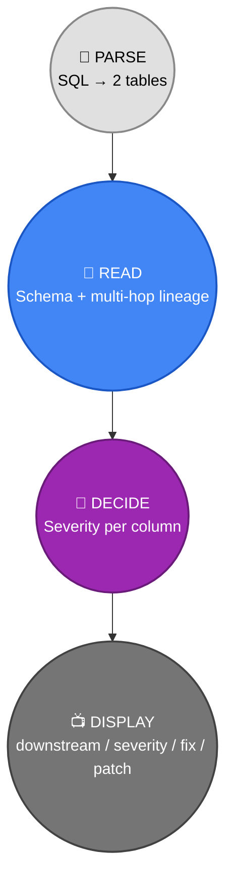
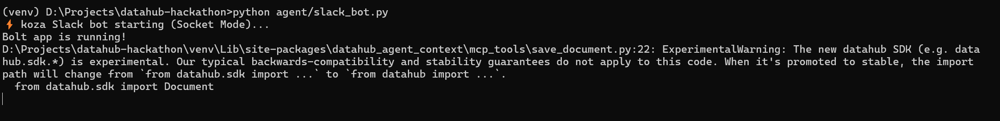
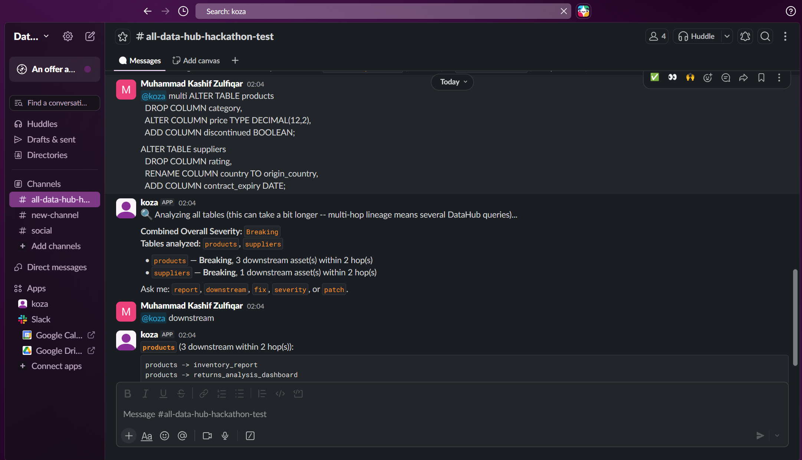
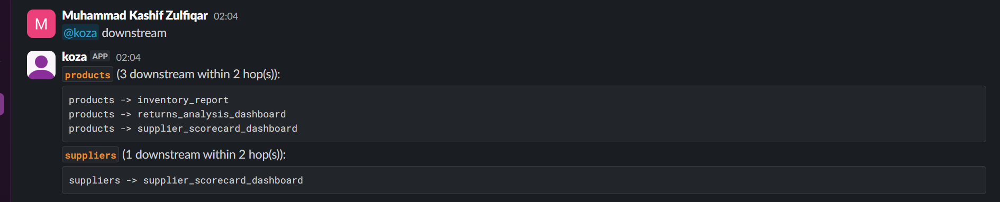
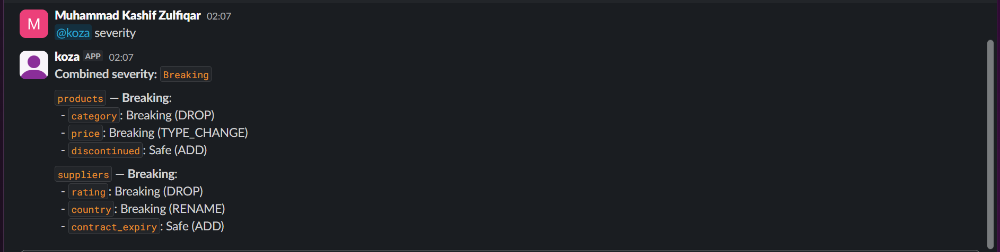
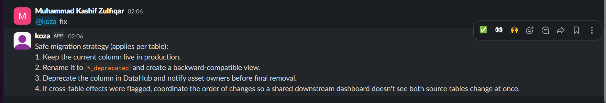
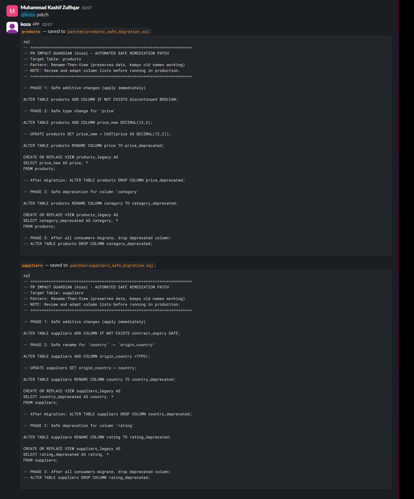
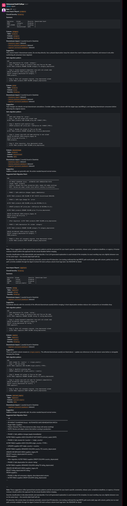

# Example B: Product & Supplier Overhaul

A two-table migration touching `products` and `suppliers` — heavy on
`TYPE_CHANGE` and `RENAME`, the two riskiest operation types, with both
tables feeding `supplier_scorecard_dashboard`. Demonstrated primarily
through **Slack**, using the `multi` command for multi-table analysis.

## The Migration

```sql
ALTER TABLE products
  DROP COLUMN category,
  ALTER COLUMN price TYPE DECIMAL(12,2),
  ADD COLUMN discontinued BOOLEAN;

ALTER TABLE suppliers
  DROP COLUMN rating,
  RENAME COLUMN country TO origin_country,
  ADD COLUMN contract_expiry DATE;
```

**Why this migration:** `price TYPE DECIMAL(12,2)` and `country ->
origin_country` are exactly the two operation types most likely to
silently break downstream consumers without Koza catching them — a type
change that looks compatible but isn't, and a rename that leaves old
references pointing at a column that no longer exists.

---

## DataHub Touchpoints in This Example

**Important difference from Examples A and C: Slack is read-only.** The
Slack bot analyzes and displays — it never writes tags or Context
Documents back to DataHub. Only Streamlit and GitHub Actions do that.
This example makes that boundary explicit rather than implying
otherwise.



| # | Command | DataHub Interaction |
|---|---|---|
| 1 | `multi <SQL>` — parse | *(local — no DataHub yet)* |
| 2 | `multi <SQL>` — analysis | 🔎 **READ** — live schema + 2-hop lineage fetched **once**, for both tables |
| 3 | `multi <SQL>` — analysis | 🧠 **DECIDE** — severity classified per column, same message |
| 4 | `downstream` | 📺 **DISPLAY** — formats the lineage chains already fetched in step 2, no new query |
| 5 | `severity` | 📺 **DISPLAY** — formats the classification already decided in step 3, no new query |
| 6 | `fix` | 📺 **DISPLAY** — static advice, no DataHub involved at all |
| 7 | `patch` | 📺 **DISPLAY** — SQL generated locally from parsed operations, no DataHub call |
| — | *(never)* | ❌ **WRITE** — no tag or Context Document is ever written from Slack in this version |

The whole session's DataHub cost is paid **once**, up front. Everything
after the initial `multi` command is free — reading back out of the
in-memory session, not re-querying DataHub on every follow-up question.

---

## Slack Workflow

**1. Bot startup.** Socket Mode connection confirmed live in the
terminal — no public URL or tunnel needed for Slack itself (separate
from the GitHub Actions tunnel to DataHub).



**2. 🔎 READ + 🧠 DECIDE — the `multi` command.** Both tables are parsed
and analyzed in one message. This is the only point in the whole Slack
session where DataHub is actually queried: live schema and multi-hop
lineage for both `products` and `suppliers`, severity classified per
column. Combined severity comes back **Breaking**.



**3. 📺 DISPLAY — `downstream`.** Lineage chains for both tables,
rendered from the lineage already fetched in step 2 — no new DataHub
call happens here.



**4. 📺 DISPLAY — `severity`.** Per-column breakdown for both tables,
formatted from the classification already decided in step 2.



**5. 📺 DISPLAY — `fix`.** Generic safe-migration strategy — static
advice, not table-specific, no DataHub round-trip.



**6. 📺 DISPLAY — `patch`.** Full safe-migration SQL for both tables,
generated locally and saved to `patches/`. Shown at full size below
since the actual patch content matters here.



**7. 📺 DISPLAY — `report`.** The complete combined impact report for
both tables — per-column detail, suggestions, and the standing
disclaimers. Shown at full size below.



---

## Other Examples

- **[Example A: Customer & Orders Cleanup](01-customer-orders-cleanup.md)** — Streamlit workflow, full write-back
- **[Example C: Support & Marketing Refresh](03-support-marketing-refresh.md)** — GitHub Actions, fully automated on a PR
