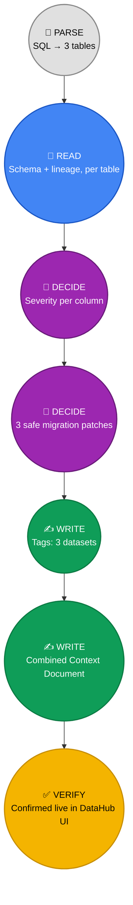
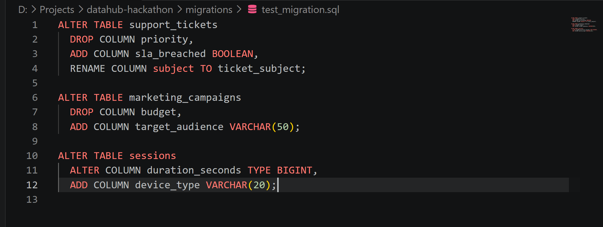
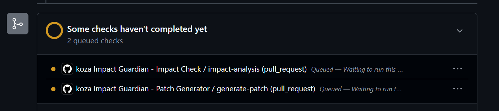
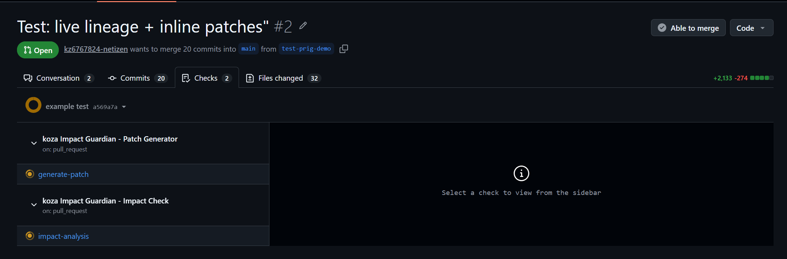
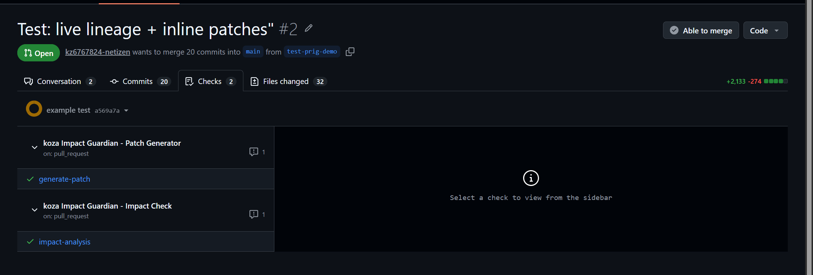
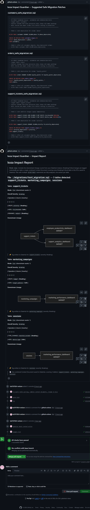
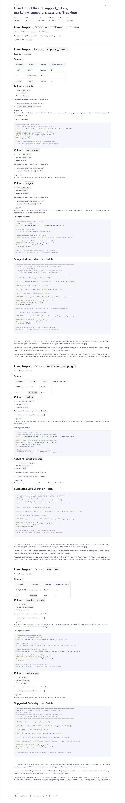
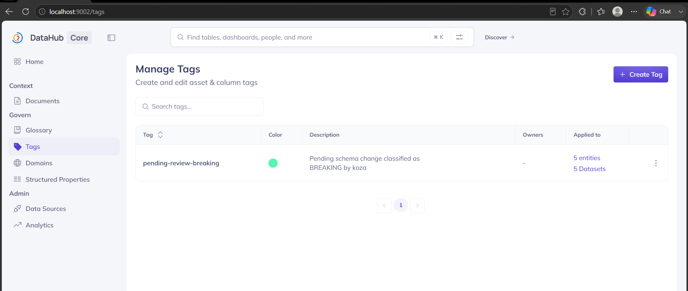
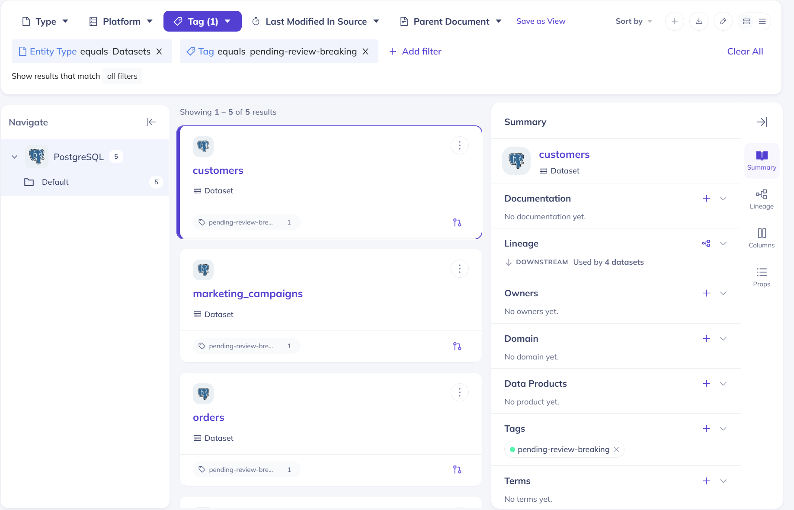

# Example C: Support & Marketing Refresh

A three-table migration — `support_tickets`, `marketing_campaigns`, and
`sessions` — where two of the three tables (`marketing_campaigns` and
`sessions`) feed the same downstream dashboard. Unlike Examples A and B,
this one is demonstrated primarily through **GitHub Actions**, running
fully automated on a real pull request with no manual interaction.

## The Migration

```sql
ALTER TABLE support_tickets
  DROP COLUMN priority,
  ADD COLUMN sla_breached BOOLEAN,
  RENAME COLUMN subject TO ticket_subject;

ALTER TABLE marketing_campaigns
  DROP COLUMN budget,
  ADD COLUMN target_audience VARCHAR(50);

ALTER TABLE sessions
  ALTER COLUMN duration_seconds TYPE BIGINT,
  ADD COLUMN device_type VARCHAR(20);
```

**Why this migration:** three tables in one PR proves Koza scales past
the two-table case, and `marketing_campaigns` + `sessions` both feeding
`marketing_performance_dashboard` gives a real cross-table effect to
demonstrate — all triggered automatically the moment a PR is opened,
no one manually pasting SQL into a UI.

---

## DataHub Touchpoints in This Example



| # | Action | DataHub Interaction |
|---|---|---|
| 1 | Parse SQL, extract 3 tables | *(local — no DataHub yet)* |
| 2 | 🔎 **READ** | Live schema + lineage lookup, once per table |
| 3 | 🧠 **DECIDE** | Severity classified per column, all 3 tables Breaking overall |
| 4 | 🧠 **DECIDE** | 3 separate safe migration patches generated |
| 5 | ✍️ **WRITE** | `Breaking` tag applied to `support_tickets`, `marketing_campaigns`, `sessions` — one write per dataset |
| 6 | ✍️ **WRITE** | One combined Context Document, linked to all 3 dataset URNs |

The key difference from the Streamlit/Slack examples: **nobody triggered
this manually.** Opening the PR was the only human action — everything
from step 1 onward ran inside GitHub's CI runner.

---

## GitHub Actions Workflow

**1. The migration file lands in the PR.** `migrations/test_migration.sql`
contains all three `ALTER TABLE` statements — this is the only file a
developer actually wrote.



**2. 📝 PARSE (queued) — Both workflows queue automatically** the moment the PR opens — no
manual trigger, no button to click. `Impact Check` and `Patch Generator`
run as independent jobs in parallel.



**3. 🔎 READ + 🧠 DECIDE — checks in progress.** This is where the live
DataHub queries and severity classification happen, entirely inside
GitHub's runner, against the DataHub instance reachable via the
configured tunnel.



**4. ✅ VERIFY (green) — Both checks pass.** Green checkmarks confirm the run completed
without errors across all 3 tables — this migration didn't hit any
Critical-severity block, so the PR remains mergeable.



**5. ✍️ WRITE — the actual output, posted as PR comments.** Two separate comments
from `github-actions[bot]`: the **Patch Generator** comment contains all
3 safe-migration `.sql` patches inline, and the **Impact Check** comment
contains the full per-table severity breakdown, downstream lineage
diagrams, and ✍️ write-back confirmation lines for all 3 tag writes plus
the one combined Context Document — all generated and posted without
anyone touching a keyboard after opening the PR.



---

## Verifying the Write-Back, Directly in DataHub

**✅ Confirms the combined document, with GitHub as the recorded
source.** Opening the document in DataHub shows `Source: ⚙️ GitHub
Actions (automated PR check)` right at the top — proof this specific
document was produced by the CI pipeline, not a manual Streamlit or
Slack session. Scrolling to the bottom of the document, the **Related**
datasets footer lists all three tables (`support_tickets`,
`marketing_campaigns`, `sessions`) as linked entities — so this one
document is discoverable from any of the three tables' pages in DataHub,
not just from a search.



**✅ Confirms all tag writes, cumulative across examples.** The
`pending-review-breaking` tag now shows **5 entities / 5 datasets** —
`orders` and `customers` from Example A's Streamlit run, plus this
example's `support_tickets`, `marketing_campaigns`, and `sessions`. Tags
accumulate correctly across separate PRs and interfaces instead of being
overwritten — a real governance signal building up over time, not a
one-off demo artifact.



**✅ Confirms each entity individually.** Filtering DataHub's own search
by `Tag: pending-review-breaking` lists every tagged dataset by name —
`customers`, `marketing_campaigns`, `orders`, and (scrolling further)
`support_tickets` and `sessions` — each showing the tag applied exactly
once, no duplicates from re-runs.



**The full loop, start to finish:** PR opened → GitHub Actions triggers
automatically → live DataHub read across 3 tables → local severity
decisions → 3 patches + 1 combined document written back → posted as PR
comments → independently verified in DataHub's own UI above, source
correctly attributed to GitHub Actions throughout.

---

## Other Examples

- **[Example A: Customer & Orders Cleanup](01-customer-orders-cleanup.md)** — Streamlit workflow, full write-back
- **[Example B: Product & Supplier Overhaul](02-product-supplier-overhaul.md)** — Slack workflow, read-only analysis
