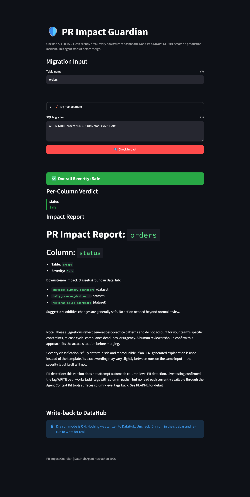
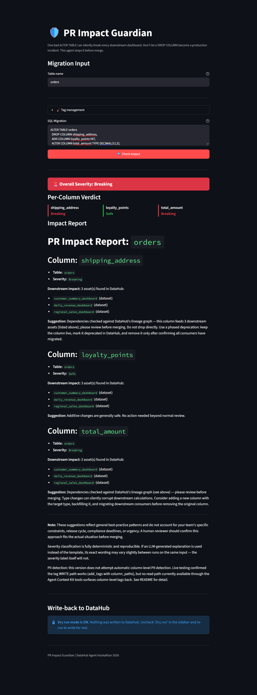
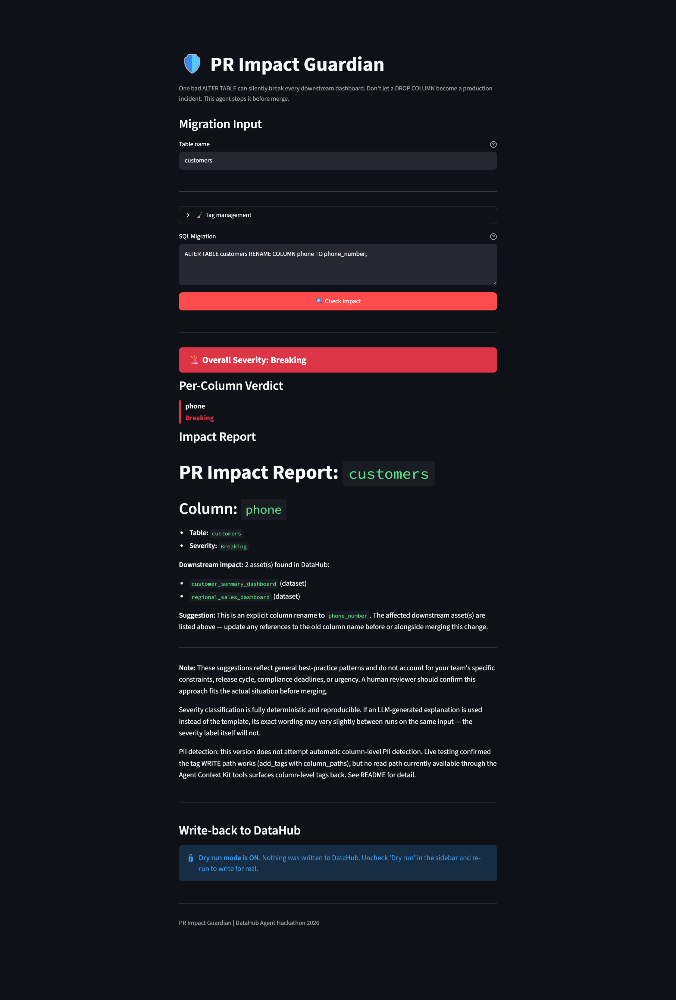
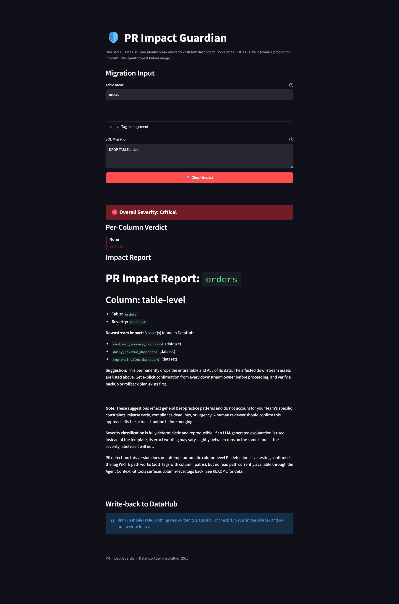
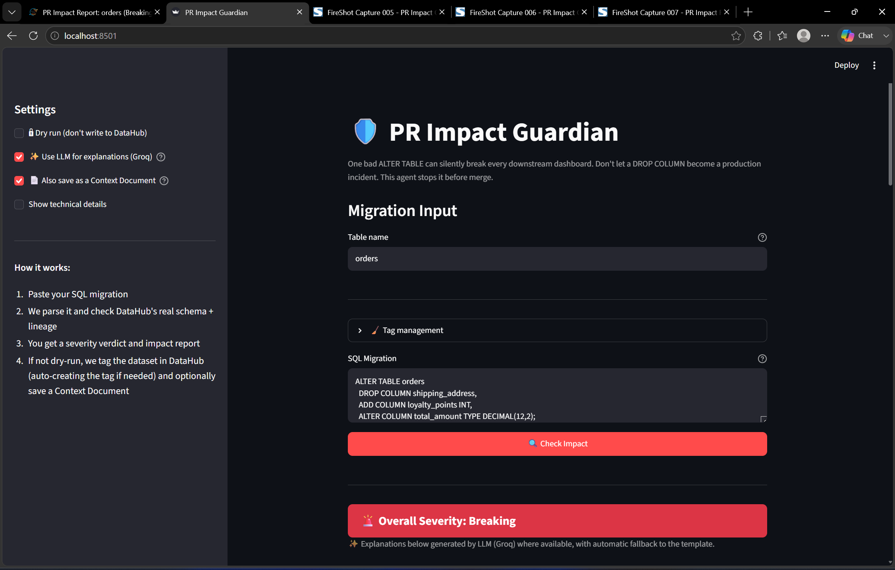
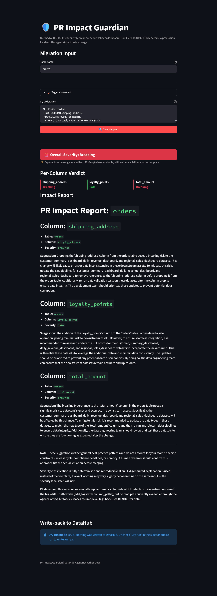
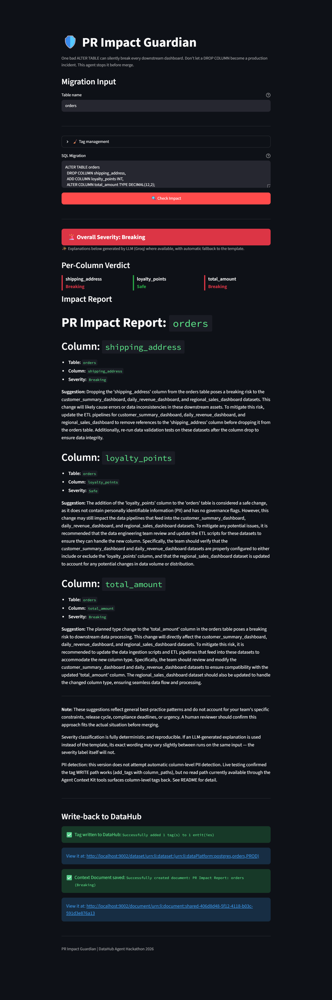
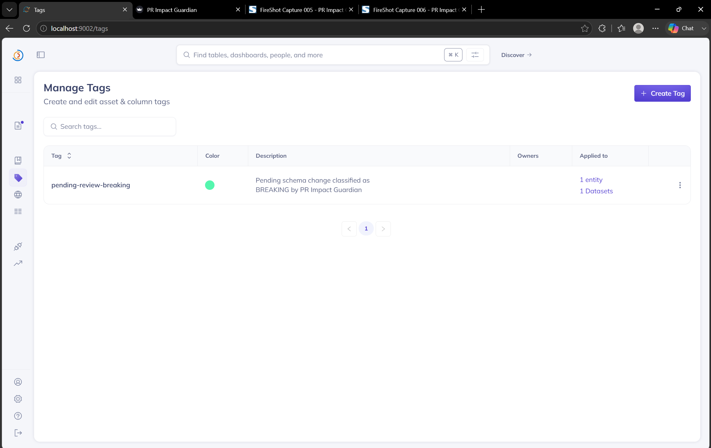
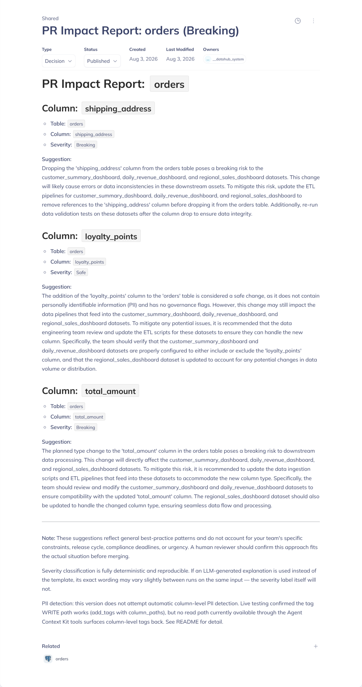
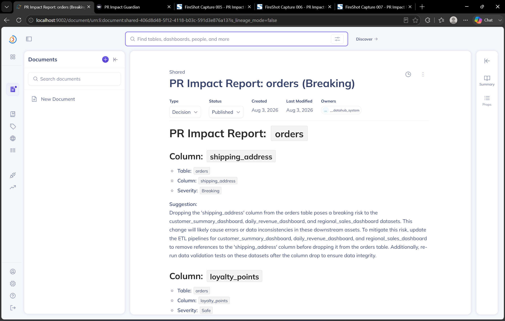

# PR Impact Guardian — Example Outputs

Five real, live-generated scenarios covering every severity tier, every
operation type supported, and the full pipeline this project implements:

**Parse → Check real DataHub lineage → Classify severity per column → Explain the impact (template or LLM) → Write back to DataHub**

All output below is copy-pasted or screenshotted directly from the running
app against a live DataHub instance — nothing here is hand-written or
simulated. `orders` has 3 real downstream dependents in the lineage graph
(`customer_summary_dashboard`, `daily_revenue_dashboard`,
`regional_sales_dashboard`); `customers` has 2.

## Table of Contents
1. [Safe — Additive Column](#1-safe--additive-column)
2. [🚨 Breaking — Multi-Operation Migration (3 ops, 3 downstream assets)](#2-breaking--multi-operation-migration)
3. [🚨 Breaking — Column Rename](#3-breaking--column-rename)
4. [⛔ Critical — Dropping the Entire Table](#4-critical--dropping-the-entire-table)
5. [✨ FULL END-TO-END FLOW — LLM Integration + Live Write-Back to DataHub](#5-full-end-to-end-flow--llm-integration--live-write-back-to-datahub)

---
---

## 1. Safe — Additive Column

**Pipeline stage demonstrated:** parse → lineage check → severity
classification → template explanation *(dry run — no write needed for a
Safe change)*

**Input SQL:**
```sql
ALTER TABLE orders ADD COLUMN status VARCHAR;
```




*If the image above doesn't display, here's the full text:*

### Column: `status` — Safe
- **Table:** `orders`
- **Severity:** `Safe`

**Downstream impact:** 3 asset(s) found in DataHub:
- `customer_summary_dashboard` (dataset)
- `daily_revenue_dashboard` (dataset)
- `regional_sales_dashboard` (dataset)

**Suggestion:** Additive changes are generally safe. No action needed beyond normal review.

---
---

## 2. Breaking — Multi-Operation Migration

> **⚠️ Compare this to Example 1 above** — same `orders` table, but this
> migration combines THREE different operation types (DROP + ADD +
> TYPE_CHANGE) in a single statement, and demonstrates the agent
> correctly assigning a DIFFERENT severity to each column independently,
> not one blanket verdict for the whole migration.

**Pipeline stage demonstrated:** parse (3 mixed operation types in one
statement) → lineage check → per-column severity classification →
template explanation, including the **"phased deprecation"** suggestion
branch, which only fires when a column feeds more than 2 downstream
assets — never seen live until this lineage graph was expanded.

**Input SQL:**
```sql
ALTER TABLE orders
  DROP COLUMN shipping_address,
  ADD COLUMN loyalty_points INT,
  ALTER COLUMN total_amount TYPE DECIMAL(12,2);
```




*If the image above doesn't display, here's the full text:*

### Column: `shipping_address` — Breaking
**Downstream impact:** 3 asset(s): `customer_summary_dashboard`, `daily_revenue_dashboard`, `regional_sales_dashboard`

**Suggestion:** Dependencies checked against DataHub's lineage graph — this column feeds 3 downstream assets (listed above); please review before merging. Do not drop directly. Use a phased deprecation: keep the column live, mark it deprecated in DataHub, and remove it only after confirming all consumers have migrated.

### Column: `loyalty_points` — Safe
**Downstream impact:** 3 asset(s), same as above.

**Suggestion:** Additive changes are generally safe. No action needed beyond normal review.

### Column: `total_amount` — Breaking
**Downstream impact:** 3 asset(s), same as above.

**Suggestion:** Dependencies checked against DataHub's lineage graph (see above) — please review before merging. Type changes can silently corrupt downstream calculations. Consider adding a new column with the target type, backfilling it, and migrating downstream consumers before removing the original column.

---
---

## 3. Breaking — Column Rename

> **⚠️ Different table, different operation type** — this exercises the
> RENAME branch specifically, on `customers` (2 real downstream assets),
> and shows the agent correctly naming the NEW column name in its
> suggestion, not just flagging that a rename happened.

**Pipeline stage demonstrated:** parse (RENAME COLUMN, its own statement
type — cannot be combined with other ALTER TABLE clauses in real
PostgreSQL) → lineage check → severity → template explanation with
target-column awareness.

**Input SQL:**
```sql
ALTER TABLE customers RENAME COLUMN phone TO phone_number;
```




*If the image above doesn't display, here's the full text:*

### Column: `phone` — Breaking
- **Table:** `customers`

**Downstream impact:** 2 asset(s) found in DataHub:
- `customer_summary_dashboard` (dataset)
- `regional_sales_dashboard` (dataset)

**Suggestion:** This is an explicit column rename to `phone_number`. The affected downstream asset(s) are listed above — update any references to the old column name before or alongside merging this change.

---
---

## 4. Critical — Dropping the Entire Table

> **⚠️ Highest severity tier** — a table-level operation always
> overrides column-level nuance. Compare the downstream count here (3)
> to what this same input showed before the lineage graph was expanded
> (1) — the agent's verdict on `orders` is now backed by real,
> multi-consumer impact data.

**Pipeline stage demonstrated:** parse (DROP TABLE, handled as its own
top-level case) → lineage check → table-level Critical severity →
template explanation.

**Input SQL:**
```sql
DROP TABLE orders;
```




*If the image above doesn't display, here's the full text:*

### Column: table-level — Critical
- **Table:** `orders`

**Downstream impact:** 3 asset(s) found in DataHub:
- `customer_summary_dashboard` (dataset)
- `daily_revenue_dashboard` (dataset)
- `regional_sales_dashboard` (dataset)

**Suggestion:** This permanently drops the entire table and ALL of its data. The affected downstream assets are listed above. Get explicit confirmation from every downstream owner before proceeding, and verify a backup or rollback plan exists first.

---
---

## 5. ✨ FULL END-TO-END FLOW — LLM Integration + Live Write-Back to DataHub

> **This is the complete pipeline, start to finish, exactly as required:**
> real SQL in → real DataHub lineage checked → severity classified →
> explanation generated by an **LLM (Groq)**, not just the template →
> **a real write-back lands in DataHub** (both a severity tag AND a
> permanent Context Document) → **independently verified inside DataHub's
> own UI**, not just trusted from an API response.

Two runs of the same migration on `orders`: once with `dry_run` ON to
safely capture the LLM-generated report, once with `dry_run` OFF to show
the actual write landing. Every ID below cross-matches across both runs
and DataHub's own UI — same tag name, same dataset URN, same Context
Document URN.

**Input SQL:**
```sql
ALTER TABLE orders
  DROP COLUMN shipping_address,
  ADD COLUMN loyalty_points INT,
  ALTER COLUMN total_amount TYPE DECIMAL(12,2);
```


-9333ea?style=for-the-badge)


### 5a. Settings used for the write-back run



*If the image above doesn't display:* Dry run **OFF**, "Use LLM for
explanations (Groq)" **ON**, "Also save as a Context Document" **ON**.

### 5b. The report — LLM-generated explanations (dry run ON, for safe capture)



*If the image above doesn't display, here's the full text:*

**Column: `shipping_address` — Breaking.** Dropping the 'shipping_address' column from the orders table poses a breaking risk to the customer_summary_dashboard, daily_revenue_dashboard, and regional_sales_dashboard datasets. This change will likely cause errors or data inconsistencies in these downstream assets. To mitigate this risk, update the ETL pipelines for customer_summary_dashboard, daily_revenue_dashboard, and regional_sales_dashboard to remove references to the 'shipping_address' column before dropping it from the orders table. Additionally, re-run data validation tests on these datasets after the column drop to ensure data integrity. The development team should prioritize these updates to prevent potential data corruption.

**Column: `loyalty_points` — Safe.** The addition of the 'loyalty_points' column to the 'orders' table is considered a safe operation, posing minimal risk to downstream assets. However, to ensure seamless integration, it is recommended to review and update the ETL scripts for the customer_summary_dashboard, daily_revenue_dashboard, and regional_sales_dashboard datasets to incorporate the new column. This will enable these datasets to leverage the additional data and maintain data consistency. The updates should be prioritized to prevent any potential data discrepancies. By doing so, the data engineering team can ensure that the downstream datasets remain accurate and up-to-date.

**Column: `total_amount` — Breaking.** The breaking type change to the 'total_amount' column in the orders table poses a significant risk to data consistency and accuracy in downstream assets. Specifically, the customer_summary_dashboard, daily_revenue_dashboard, and regional_sales_dashboard datasets will be affected by this change. To mitigate this risk, it is recommended to update the data types in these datasets to match the new type of the 'total_amount' column, and then re-run any relevant data pipelines to ensure data integrity. Additionally, the data engineering team should review and test these datasets to ensure they are functioning as expected after the change.

### 5c. Live write-back confirmation (dry run OFF)



*Note: LLM wording in this run differs slightly from 5b above — same
facts, different phrasing, since the LLM response is non-deterministic.
The severity labels are identical both times, since those are always
deterministic regardless of explanation mode.*

**Real write-back result:**
```
✅ Tag written to DataHub: Successfully added 1 tag(s) to 1 entit(ies)
View it at: http://localhost:9002/dataset/urn:li:dataset:(urn:li:dataPlatform:postgres,orders,PROD)

✅ Context Document saved: Successfully created document: PR Impact Report: orders (Breaking)
View it at: http://localhost:9002/document/urn:li:document:shared-406d8d48-5f12-4118-b03c-591d3e876a13
```

### 5d. Independently verified inside DataHub — the tag



*If the image above doesn't display:* the `pending-review-breaking` tag,
**auto-created by the agent itself** (no manual pre-creation needed) with
description *"Pending schema change classified as BREAKING by PR Impact
Guardian"*, confirmed applied to **1 entity / 1 Datasets** — matching the
API response, not just claiming it.

### 5e. Independently verified inside DataHub — the Context Document





*If the images above don't display:* the saved document, titled **"PR
Impact Report: orders (Breaking)"**, Type: `Decision`, Status:
`Published`, Owner: `__datahub_system`, containing the exact same
per-column content shown in 5b above — and its real URL
(`.../document/urn:li:document:shared-406d8d48-5f12-4118-b03c-591d3e876a13`)
matches the URN returned in the write-back response, confirming this is
the actual document that call created.

---
---

## Standing Disclaimers (apply to every example above)

**These suggestions reflect general best-practice patterns** and do not
account for your team's specific constraints, release cycle, compliance
deadlines, or urgency. A human reviewer should confirm this approach fits
the actual situation before merging.

**Severity classification is fully deterministic and reproducible.** If
an LLM-generated explanation is used instead of the template, its exact
wording may vary slightly between runs on the same input — the severity
label itself will not (demonstrated directly in Example 5 above: identical
severities, different wording, across two real runs).

**PII detection:** this version does not attempt automatic column-level
PII detection. Live testing confirmed the tag WRITE path works (`add_tags`
with `column_paths`), but no read path currently available through the
Agent Context Kit tools surfaces column-level tags back. See README for
detail.
