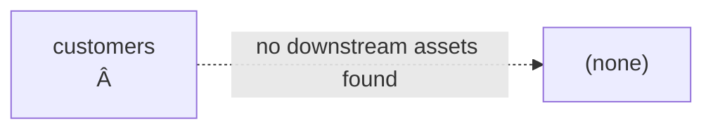

# PRIG Impact Report

> **Mode:** `offline`. No DataHub connection configured or reachable -- severity reflects structural risk only. No write-back performed. Files with multiple `ALTER TABLE` statements are fully analyzed, one section per table.

## File: `.\migrations\test_migration.sql`

### Table: `customers
Â`

**Mode:** `offline`

**Overall Severity:** `Breaking`

| Operation | Column | Severity |

|---|---|---|

| UNKNOWN | `None` | **Breaking** |

| UNKNOWN | `None` | **Breaking** |

| UNKNOWN | `None` | **Breaking** |

| UNKNOWN | `None` | **Breaking** |

| UNKNOWN | `None` | **Breaking** |

| UNKNOWN | `None` | **Breaking** |

| UNKNOWN | `None` | **Breaking** |

| UNKNOWN | `None` | **Breaking** |

#### Downstream Lineage

