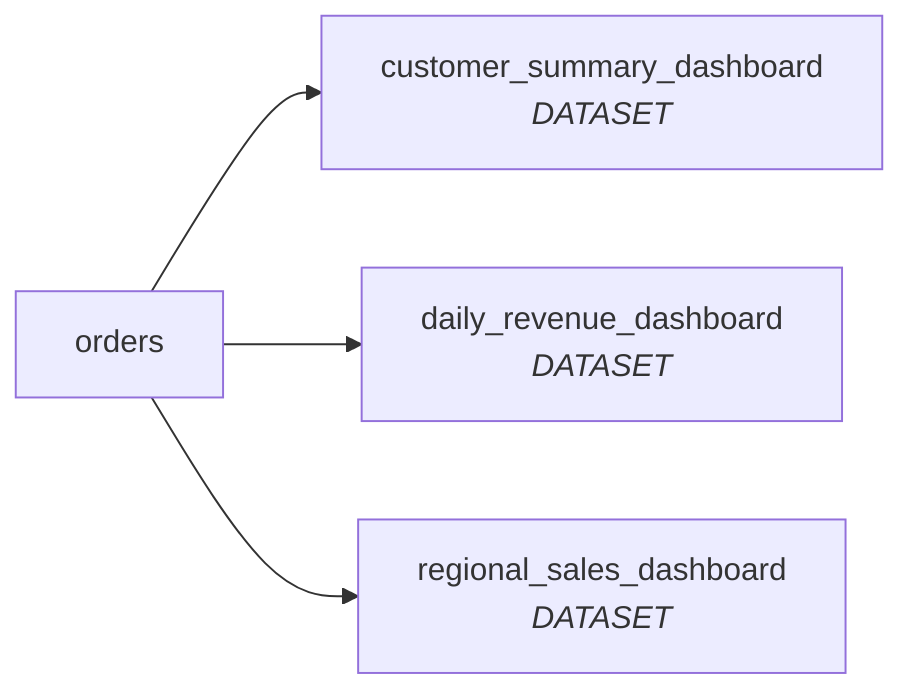

# PRIG Impact Report

> **Mode:** `live`. Includes live downstream lineage counts from your DataHub instance. Breaking/Critical changes are tagged and logged as Context Documents in DataHub automatically.

## File: `.\migrations\test_migration.sql`

**Table:** `orders`

**Mode:** `live` (downstream assets: 3)

**Overall Severity:** `Breaking`

| Operation | Column | Severity |

|---|---|---|

| DROP | `shipping_address` | **Breaking** |

| ADD | `loyalty_points` | **Safe** |

### Downstream Lineage

> 🏷️ Tag written to DataHub for `orders` (severity: Breaking).

> 📄 Context Document saved to DataHub for `orders`.

